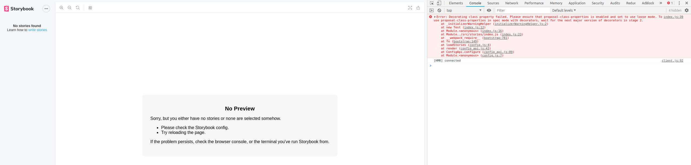

# Storyboook 5.X MobX decorators example :bug:

Repository reproducing legacy MobX decorators issue in storybooks - https://github.com/storybooks/storybook/issues/6069

_Created based on create-react-app._

## How to see the issue? :bug:

1. Install dependencies

    ```bash
    yarn install
    ```

1. Start storybook server

    ```bash
    yarn storybook
    ```
    Browser on port 9009 will be opened.

1. Open developers console and you will see the error there :bug:.


